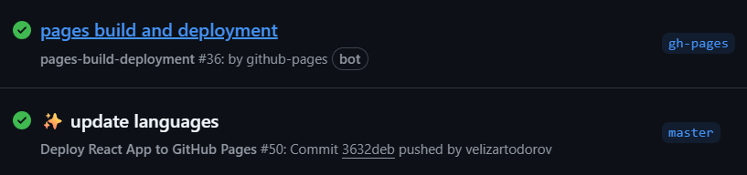

# Velizar's portfolio 👨‍💼

React-based single page web application representing Velizar's portfolio:

<https://velizartodorov.github.io/>

## How to start locally? 🤔

In project directory, run in terminal:

```js
npm start
```

Go to <http://localhost:3000/>.

That's it. Have fun! 😎 🎉

## CI/CD 🚀

🔁  Two Runs Are Triggered:

1️⃣ The custom `deployment.yml` workflow:

* Runs on push to `master` branch.
* Builds the React app and deploys it using `peaceiris/actions-gh-pages`.
* Then pushes to the `gh-pages` branch.

2️⃣ GitHub Pages built-in deployment job (`pages-build-deployment`):

* This is automatically triggered when a push is made to the configured GitHub Pages source branch – `gh-pages`.

This job is run by the `github-pages` bot and performs the actual publishing of the site.

So:

* The `deployment.yml` pushes built assets to `gh-pages`.
* GitHub Pages detects that push and runs its own internal deploy step (`pages-build-deployment`).

Example:


