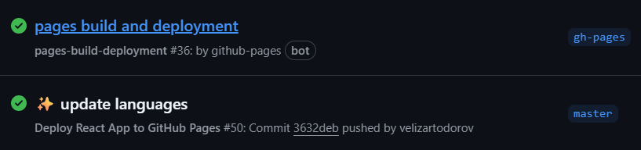

# Velizar's portfolio 👨‍💼

React-based single page web application representing Velizar's portfolio:

<https://velizartodorov.github.io/>

## How to start locally? 🤔

First, install the dependencies:

```bash
npm install
```

Then, to start the development server:

```bash
npm run dev
```

The app will be available at <http://localhost:3000/>.

To build for production:

```bash
npm run build
```

To preview the production build locally:

```bash
npm run preview
```

That's it. Have fun! 😎 🎉

## Translation files 🔠

The application uses JSON files for translations located in the `src/translations` directory.
Each language (en, nl) has its own set of translation files.

### Structure

- `src/translations/`
  - `en/` - English translations
  - `nl/` - Dutch translations
  - Each language folder contains:
    - Common translation files (`.json`)
    - `employments/` - Individual employment entries
    - `employments.json` - Index file defining the order of employment entries

## CI/CD 🚀

### Github Workflows 🏭

The custom `build-deploy.yml` workflow makes sure that:

- when opening a PR the application will be built with clean dependencies
- when pushing to `master`, it will be automatically deployed

Example:



### Dependabot 🤖

`dependabot.yml` will make sure that bumping of library happens on a regular
basis by Dependabot with automatic opening of a PR.
