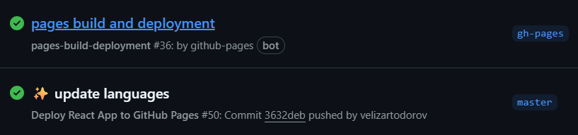

# Velizar's portfolio 👨‍💼

[](https://github.com/velizartodorov/velizartodorov.github.io/actions/workflows/build-deploy.yml)
[](https://github.com/velizartodorov/velizartodorov.github.io/actions/workflows/sonarcloud.yml)


Next.js (App Router, static export) web application representing Velizar's portfolio:

<https://velizartodorov.github.io/>

## How to start locally? 🤔

The resume content and identity-revealing assets (employer/school logos, the certificate PDF,
the personal photo) live in a private submodule (see "Translation files" below), so building or
running this app locally requires git access to that private repo - there's no fallback/mock
content path. If you're not the maintainer, `npm run dev`/`npm run build` won't succeed.

First, install the dependencies:

```bash
npm install
```

Then, to start the development server:

```bash
npm run dev
```

The app will be available at <http://localhost:3000/>.

To build for production (outputs a static site to `out/`):

```bash
npm run build
```

To preview the production build locally:

```bash
npm run serve
```

That's it. Have fun! 😎 🎉

## Translation files 🔠

The application uses YAML and Markdown files for translations located in the
`src/app/translations` directory. Each language (en, nl) has its own set of translation files.
Rather than a static per-language bundle, each file is fetched on demand through a dynamic
`import()` templated on the language, so a page only ever downloads the one language's content it
actually renders; the results are then assembled into a single resources object for that
language.

The actual resume content (dates, employment/education text, employer/school names) and the
identity-revealing static assets (employer/school logos, the certificate PDF, the personal photo)
are personal data and don't live in this public repo - they live in the private
`velizartodorov/portfolio-resources` repo, mounted here as a git submodule at
`src/app/translations/data/`. `predev`/`prebuild` (see `scripts/prepare-resources.mjs`)
initialize that submodule and copy its `assets/` subtree into `public/resources/` (gitignored,
regenerated on every build) - the raw yml/md text is never copied anywhere under `public/`, so it
never becomes part of the statically-served/exported site.

### Structure

- `src/app/translations/`
  - `data/` - git submodule ([`portfolio-resources`](https://github.com/velizartodorov/portfolio-resources),
    private), containing:
    - `dates.yml` - shared date placeholders (e.g. `collibra_start`), referenced from content as
      `{{dates:collibra_start}}` and resolved at runtime by `useEmployments()`
    - `en/`, `nl/` - one folder per language, each containing:
      - `common.yml`, `introduction.yml`, `languages.yml`, `licenses_certifications.yml`,
        `presentations.yml`, `profile.yml` - simple key/value YAML namespaces
      - `employments.yml`, `education.yml` - index files (`title` + ordered `list` of filenames)
        defining which entries appear and in what order
      - `employments/*.md`, `education/*.md` - one Markdown file per entry, with YAML frontmatter
        (company/place/period, etc.) and the description as the Markdown body. Employment entries
        with multiple positions separate each position's body with an `<!-- position -->` marker
    - `resource-files.ts` - the single source of truth for which employment/education Markdown
      files exist (`EMPLOYMENT_FILES` / `EDUCATION_FILES`), typed so a filename present in one
      language's folder but missing (or misspelled) in the other fails to compile
    - `assets/` - the employer/school logos, certificate PDF, and personal photo; `icon:`/`link:`/
      `imageUrl:` fields in the yml/md above reference these under `/resources/...`, matching
      where `prepare-resources.mjs` copies them under `public/`
  - `resources.ts` - `loadResources(lang)`, which dynamically imports every YAML/Markdown file for
    a language and hands them to `build-resources.ts`
  - `build-resources.ts` - `buildLanguageResources()` assembles the loaded index files plus their
    Markdown entries into the final `{ title, list }` shape consumed by the app (splitting
    multi-position employment bodies on the `<!-- position -->` marker along the way)
  - `completeness.test.ts` - Vitest check that every key path present in `en`'s resources also
    exists in `nl` (and vice versa), so a missing translation fails the build instead of silently
    falling back

Markdown frontmatter is parsed at build time by `loaders/markdown-frontmatter-loader.cjs`
(via `gray-matter`), which turns each `.md` file into a JS module exporting its frontmatter
fields plus a `body` string.

## CI/CD 🚀

### Github Workflows 🏭

Three workflows run in `.github/workflows/`. The `build`/`link-check` jobs in `build-deploy.yml`
and the `sonarcloud` job in `sonarcloud.yml` each start with a "Fetch private resources" step
(`node scripts/prepare-resources.mjs`, given the `RESOURCES_REPO_TOKEN` repo secret - a
fine-grained PAT scoped to `portfolio-resources` with `Contents: Read-only`) before installing
dependencies, since the test run itself exercises the private submodule's content. That PAT
expires (fine-grained tokens max out around a year) and needs rotating before then, or every
workflow that touches the submodule breaks.

- **`build-deploy.yml`** - on PR and on push to `master`: installs dependencies, checks for
  encoding corruption, lints, runs the Vitest suite (excluding the link-check/analytics tests,
  which run separately), and builds the static export. Pushes to `master` (and manual
  `workflow_dispatch` runs) additionally upload and deploy the build to GitHub Pages. To avoid
  triggering CI/deploys for doc-only changes, both the `pull_request` and `push` triggers ignore
  `**.md` files - except any Markdown under `src/`, since those files (translations, employment
  and education entries) are real content consumed by the build. A separate `link-check` job in
  the same workflow (non-blocking, `continue-on-error`) checks external links and the Google
  Analytics measurement ID.
- **`sonarcloud.yml`** - on PR and on push to `master`: runs the Vitest suite with coverage and
  feeds it to a SonarCloud scan; on PRs it also posts a comment with the overall coverage
  percentage and a per-file breakdown (SonarCloud's own PR comment only covers new/changed
  lines). `sonar-project.properties` excludes `src/app/translations/data/**` (the private
  submodule) from the source scan, so its content is never uploaded to SonarCloud.
- **`auto-merge-dependabot.yml`** - see below.

Vercel also builds a preview deployment for every PR (`npm run build`, triggered by the Vercel
GitHub integration rather than a workflow file here) and needs the same private-repo access;
its `RESOURCES_REPO_TOKEN` project environment variable (Production, Preview, and Development)
holds the same PAT and must be kept in sync with the GitHub repo secret, including after
rotation.

Example:



### Dependabot 🤖

`dependabot.yml` bumps npm dependencies on a daily schedule (08:00 Brussels time), opening one PR
per update (`vitest`/`@vitest/*` are grouped into a single PR) with `rebase-strategy: auto` so
Dependabot keeps branches up to date itself.

The `auto-merge-dependabot.yml` workflow then merges those PRs automatically once their checks
pass. It triggers as soon as the `Build and Deploy` workflow finishes on a Dependabot branch
(`workflow_run`), with a periodic run every 3 hours as a fallback in case that trigger is ever
missed, plus a manual `workflow_dispatch` trigger. For each open Dependabot PR whose checks are
green, it squash-merges and deletes the branch, then asks Dependabot itself (via an
`@dependabot rebase` comment) to rebase any remaining out-of-date PRs rather than rebasing them
itself - a push from this workflow's own token would show up as an untrusted actor and get gated
behind a manual approval, which would block auto-merge. After merging at least one PR it also
triggers a fresh `build-deploy.yml` run against `master` so the deployment picks up the update.

This ensures dependencies are kept up-to-date automatically while maintaining code quality through automated testing.
